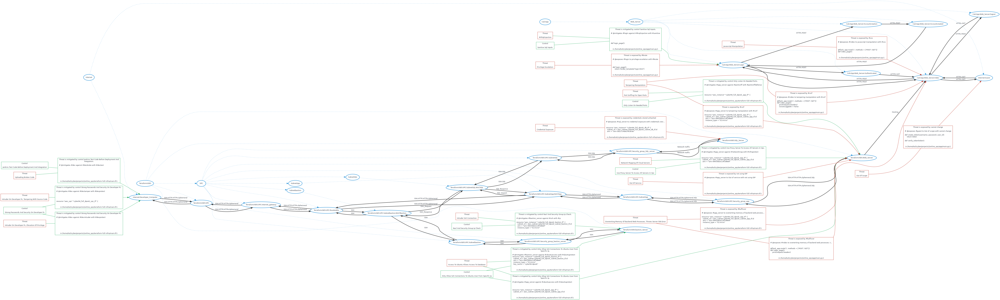

# Threatspec Project Threat Model

A threatspec project.


# Diagram



# Exposures

## Out of scope against Internet:Guest
Cannot change

```
# @exposes #guest to Out of scope with cannot change


def create_token(username, password, user_id):
    return token


```
/home/kali/cyber/projects2/online_ops/app/main.py:1

## Out of scope against Internet:AuthenticatedUser
Cannot change

```
# @exposes #auser to Out of scope with cannot change

def create_token(username, password, user_id):
    return token

def verify_token(token):

```
/home/kali/cyber/projects2/online_ops/app/main.py:1

## Javascript manipulation against CalcApp:Web_Server:Index
#xss

```
# @exposes #index to javascript manipulation with #xss


```
/home/kali/cyber/projects2/online_ops/app/main.py:1

## Overwriting memory of backend web processes. throws sevrer 500 error against CalcApp:Web_Server:Index
#buffover

```
# @exposes #index to overwriting memory of backend web processes. throws sevrer 500 error with #buffover


```
/home/kali/cyber/projects2/online_ops/app/main.py:1

## Overwriting memory of backend web processes. throws sevrer 500 error against Jenkins:TerraformAWS:Web_Server
#buffover

```
# @exposes #app_server to overwriting memory of backend web processes. throws sevrer 500 error with #buffover


```
/home/kali/cyber/projects2/online_ops/app/main.py:1

## Overwriting memory of backend web processes. throws sevrer 500 error against CalcApp:Web_Server:Login
#buffover

```
# @exposes #login to overwriting memory of backend web processes. throws sevrer 500 error with #buffover


```
/home/kali/cyber/projects2/online_ops/app/main.py:1

## Tampering manipulation against CalcApp:Web_Server:Index
#csrf

```
# @exposes #index to tampering manipulation with #csrf


```
/home/kali/cyber/projects2/online_ops/app/main.py:1

## Tampering manipulation against CalcApp:Web_Server:Results
#csrf

```
# @exposes #results to tampering manipulation with #csrf


```
/home/kali/cyber/projects2/online_ops/app/main.py:1

## Tampering manipulation against 
#csrf

```
# @exposes #authenticated to tampering manipulation with #csrf


```
/home/kali/cyber/projects2/online_ops/app/main.py:1

## Information disclosure against CalcApp:Web_Server:Index
#cache

```
# @exposes #index to information disclosure with #cache


@flask_app.route('/', methods = ['POST','GET'])
def index_page():
    print(request.headers)

```
/home/kali/cyber/projects2/online_ops/app/main.py:1

## Information disclosure against CalcApp:Web_Server:Login
#cache

```
# @exposes #login to information disclosure with #cache


@flask_app.route('/', methods = ['POST','GET'])
def index_page():
    print(request.headers)

```
/home/kali/cyber/projects2/online_ops/app/main.py:1

## Information disclosure against CalcApp:Web_Server:logout
#cache

```
# @exposes #logout to information disclosure with #cache


@flask_app.route('/', methods = ['POST','GET'])
def index_page():
    print(request.headers)

```
/home/kali/cyber/projects2/online_ops/app/main.py:1

## Information disclosure against CalcApp:Web_Server:Accountcreation
#cache

```
# @exposes #ac to information disclosure with #cache


@flask_app.route('/', methods = ['POST','GET'])
def index_page():
    print(request.headers)

```
/home/kali/cyber/projects2/online_ops/app/main.py:1

## Privilege escalation against CalcApp:Web_Server:Login
#brute

```
# @exposes #login to privilege escalation with #brute


def login_page():
    return render_template('login.html')


```
/home/kali/cyber/projects2/online_ops/app/main.py:1

## Information disclosure against CalcApp:Web_Server:Index
#brute

```
# @exposes #index to information disclosure with #brute


def login_page():
    return render_template('login.html')


```
/home/kali/cyber/projects2/online_ops/app/main.py:1

## Information disclosure against CalcApp:Web_Server:logout
#brute

```
# @exposes #logout to information disclosure with #brute


def login_page():
    return render_template('login.html')


```
/home/kali/cyber/projects2/online_ops/app/main.py:1

## Information disclosure against CalcApp:Web_Server:Accountcreation
#brute

```
# @exposes #ac to information disclosure with #brute


def login_page():
    return render_template('login.html')


```
/home/kali/cyber/projects2/online_ops/app/main.py:1

## Information disclosure against Internet:AuthenticatedUser
#brute

```
# @exposes #auser to information disclosure with #brute


def login_page():
    return render_template('login.html')


```
/home/kali/cyber/projects2/online_ops/app/main.py:1

## Information disclosure against Jenkins:TerraformAWS:SQL_Server
#brute

```
# @exposes #sql_server to information disclosure with #brute


def login_page():
    return render_template('login.html')


```
/home/kali/cyber/projects2/online_ops/app/main.py:1

## Out of service against Jenkins:TerraformAWS:Web_Server
Not using idp

```
# @exposes #app_server to Out of service with not using IDP


```
/home/kali/cyber/projects2/online_ops/terraform-full-infra/main.tf:1

## Overwriting memory of backend web processes. throws sevrer 500 error against Jenkins:TerraformAWS:Web_Server
#buffover

```
# @exposes #app_server to overwriting memory of backend web processes. throws sevrer 500 error with #buffover

resource "aws_instance" "cyber94_full_dpook_app_tf" {
  subnet_id = aws_subnet.cyber94_full_dpook_subnet_app_tf.id
  ami = "ami-0943382e114f188e8"
  instance_type = "t2.micro"

```
/home/kali/cyber/projects2/online_ops/terraform-full-infra/main.tf:1

## Tampering manipulation against Jenkins:TerraformAWS:Web_Server
#csrf

```
# @exposes #app_server to tampering manipulation with #csrf

resource "aws_instance" "cyber94_full_dpook_app_tf" {
  subnet_id = aws_subnet.cyber94_full_dpook_subnet_app_tf.id
  ami = "ami-0943382e114f188e8"
  instance_type = "t2.micro"

```
/home/kali/cyber/projects2/online_ops/terraform-full-infra/main.tf:1

## Credential exposure against Jenkins:TerraformAWS:SQL_Server
Credentials stored unhashed

```
# @exposes #sql_server to credential exposure with credentials stored unhashed


resource "aws_instance" "cyber94_full_dpook_db_tf" {
  subnet_id = aws_subnet.cyber94_full_dpook_subnet_db_tf.id
  ami = "ami-0d1c7c4de1f4cdc9a"

```
/home/kali/cyber/projects2/online_ops/terraform-full-infra/main.tf:1


# Acceptances


# Transfers


# Mitigations

## ##sqlinjection against CalcApp:Web_Server:Login mitigated by Sanitise sql inputs


```
# @mitigates #login against #sqlinjection with #sanitise


def login_page():

```
/home/kali/cyber/projects2/online_ops/app/main.py:1

## ##sqlinjection against Jenkins:TerraformAWS:SQL_Server mitigated by Sanitise sql inputs


```
# @mitigates #sql_server against #sqlinjection with #sanitise


def login_page():

```
/home/kali/cyber/projects2/online_ops/app/main.py:1

## ##sqlinjection against CalcApp:Web_Server:Index mitigated by Sanitise sql inputs


```
# @mitigates #index against #sqlinjection with #sanitise


def login_page():

```
/home/kali/cyber/projects2/online_ops/app/main.py:1

## ##sqlinjection against CalcApp:Web_Server:Accountcreation mitigated by Sanitise sql inputs


```
# @mitigates #ac against ##sqlinjection with #sanitise

@flask_app.route('/addlogin', methods = ['POST'])
def addlogin_page():
    return render_template('addlogin.html')


```
/home/kali/cyber/projects2/online_ops/app/main.py:1

## Intruder on developer pc, elevation of privilege against Internet:Developer_Computer mitigated by Strong passwords and security on developer pc


```
# @mitigates #dev against #devintruder with #devprotect


```
/home/kali/cyber/projects2/online_ops/terraform-full-infra/main.tf:1

## Uploading broken code against Internet:Developer_Computer mitigated by Jenkins test code before deployment and integration


```
# @mitigates #dev against #devbroke with #devtest


```
/home/kali/cyber/projects2/online_ops/terraform-full-infra/main.tf:1

## Intruder on developer pc, tampering with source code against Internet:Developer_Computer mitigated by Strong passwords and security on developer pc


```
# @mitigates #dev against #devtamper with #devprotect


resource "aws_vpc" "cyber94_full_dpook_vpc_tf" {

```
/home/kali/cyber/projects2/online_ops/terraform-full-infra/main.tf:1

## Port sniffing for open ports against Jenkins:TerraformAWS:Web_Server mitigated by Only listen on needed ports


```
# @mitigates #app_server against #portsniff with #portsniffdefense


resource "aws_instance" "cyber94_full_dpook_app_tf" {

```
/home/kali/cyber/projects2/online_ops/terraform-full-infra/main.tf:1

## Access to ubuntu allows access to database against Jenkins:TerraformAWS:Web_Server mitigated by Only allow ssh connections to ubuntu user from specific ip


```
# @mitigates #app_server against #ubuntuaccess with #ubuntuprotect


resource "aws_instance" "cyber94_full_dpook_app_tf" {
  subnet_id = aws_subnet.cyber94_full_dpook_subnet_app_tf.id

```
/home/kali/cyber/projects2/online_ops/terraform-full-infra/main.tf:1

## Network mapping of cloud servers against Jenkins:TerraformAWS:Web_Server mitigated by Use proxy server to access all servers in vpc


```
# @mitigates #app_server against #networkmap with #infraprotect


resource "aws_instance" "cyber94_full_dpook_app_tf" {
  subnet_id = aws_subnet.cyber94_full_dpook_subnet_app_tf.id
  ami = "ami-0943382e114f188e8"

```
/home/kali/cyber/projects2/online_ops/terraform-full-infra/main.tf:1

## Intruder ssh connection against Jenkins:TerraformAWS:bastion_Server mitigated by Nacl and security group ip check


```
# @mitigates #bastion_server against #ssh with #ip


resource "aws_instance" "cyber94_full_dpook_bastion_tf" {
  subnet_id = aws_subnet.cyber94_full_dpook_subnet_bastion_tf.id
  ami = "ami-0943382e114f188e8"

```
/home/kali/cyber/projects2/online_ops/terraform-full-infra/main.tf:1

## Open ports on with public ip against Jenkins:TerraformAWS:bastion_Server mitigated by Only developer computer ip allowed through


```
# @mitigates #bastion_server against #ipport with #devip

resource "aws_instance" "cyber94_full_dpook_bastion_tf" {
  subnet_id = aws_subnet.cyber94_full_dpook_subnet_bastion_tf.id
  ami = "ami-0943382e114f188e8"
  instance_type = "t2.micro"

```
/home/kali/cyber/projects2/online_ops/terraform-full-infra/main.tf:1

## Access to ubuntu allows access to database against Jenkins:TerraformAWS:bastion_Server mitigated by Only allow ssh connections to ubuntu user from specific ip


```
# @mitigates #bastion_server against #ubuntuaccess with #ubuntuprotect
resource "aws_instance" "cyber94_full_dpook_bastion_tf" {
  subnet_id = aws_subnet.cyber94_full_dpook_subnet_bastion_tf.id
  ami = "ami-0943382e114f188e8"
  instance_type = "t2.micro"
  key_name = "cyber94-dpook"

```
/home/kali/cyber/projects2/online_ops/terraform-full-infra/main.tf:1


# Reviews


# Connections

## Jenkins:TerraformAWS:Web_Server To Developer_Computer:Jenkins:Dockerhub:Container
Hosting

```
# @connects #app_server to #container with Hosting


```
/home/kali/cyber/projects2/online_ops/app/main.py:1

## Developer_Computer:Jenkins:Dockerhub:Container To CalcApp:Web_Server:Index
Running

```
# @connects #container to #index with Running


```
/home/kali/cyber/projects2/online_ops/app/main.py:1

## Internet:Guest To CalcApp:Web_Server:Index
HTTPs-GET

```
# @connects #guest to #index with HTTPs-GET


```
/home/kali/cyber/projects2/online_ops/app/main.py:1

## CalcApp:Web_Server:Index To Internet:Guest
HTTPs-GET

```
# @connects #index to #guest with HTTPs-GET


```
/home/kali/cyber/projects2/online_ops/app/main.py:1

## Internet:AuthenticatedUser To CalcApp:Web_Server:Index
HTTPs-POST

```
# @connects #auser to #index with HTTPs-POST


```
/home/kali/cyber/projects2/online_ops/app/main.py:1

## CalcApp:Web_Server:Index To Internet:AuthenticatedUser
HTTPs-POST

```
# @connects #index to #auser with HTTPs-POST


```
/home/kali/cyber/projects2/online_ops/app/main.py:1

## CalcApp:Web_Server:Index With CalcApp:Web_Server:Login
HTTPs-POST

```
# @connects #index with #login with HTTPs-POST


```
/home/kali/cyber/projects2/online_ops/app/main.py:1

## CalcApp:Web_Server:Login With CalcApp:Web_Server:Index
HTTPs-POST

```
# @connects #login with #index with HTTPs-POST


```
/home/kali/cyber/projects2/online_ops/app/main.py:1

## Internet:Guest To CalcApp:Web_Server:Login
HTTPs-POST

```
# @connects #guest to #login with HTTPs-POST


```
/home/kali/cyber/projects2/online_ops/app/main.py:1

## CalcApp:Web_Server:Login To Internet:Guest
HTTPs-POST

```
# @connects #login to #guest with HTTPs-POST


```
/home/kali/cyber/projects2/online_ops/app/main.py:1

## CalcApp:Web_Server:Accountcreation With CalcApp:Web_Server:Accountcreated
HTTPs-POST

```
# @connects #ac with #acd with HTTPs-POST

@flask_app.route('/addlogin', methods = ['POST'])
def addlogin_page():
    return render_template('addlogin.html')


```
/home/kali/cyber/projects2/online_ops/app/main.py:1

## CalcApp:Web_Server:Login With CalcApp:Web_Server:Accountcreation
HTTPs-POST

```
# @connects #login with #ac with HTTPs-POST

@flask_app.route('/addlogin', methods = ['POST'])
def addlogin_page():
    return render_template('addlogin.html')


```
/home/kali/cyber/projects2/online_ops/app/main.py:1

## Internet:Guest To CalcApp:Web_Server:Accountcreation
HTTPs-POST

```
# @connects #guest to #ac with HTTPs-POST

@flask_app.route('/addlogin', methods = ['POST'])
def addlogin_page():
    return render_template('addlogin.html')


```
/home/kali/cyber/projects2/online_ops/app/main.py:1

## CalcApp:Web_Server:Accountcreation To Internet:Guest
HTTPs-POST

```
# @connects #ac to #guest with HTTPs-POST

@flask_app.route('/addlogin', methods = ['POST'])
def addlogin_page():
    return render_template('addlogin.html')


```
/home/kali/cyber/projects2/online_ops/app/main.py:1

## CalcApp:Web_Server:Accountcreated With CalcApp:Web_Server:Login
HTTPs-POST

```
# @connects #acd with #login with HTTPs-POST

@flask_app.route('/accountcreated', methods = ['POST'])
def accountcreated_page():

    password = data['password']

```
/home/kali/cyber/projects2/online_ops/app/main.py:1

## Internet:Guest To CalcApp:Web_Server:Accountcreated
HTTPs-POST

```
# @connects #guest to #acd with HTTPs-POST

@flask_app.route('/accountcreated', methods = ['POST'])
def accountcreated_page():

    password = data['password']

```
/home/kali/cyber/projects2/online_ops/app/main.py:1

## CalcApp:Web_Server:Accountcreated To Internet:Guest
HTTPs-POST

```
# @connects #acd to #guest with HTTPs-POST

@flask_app.route('/accountcreated', methods = ['POST'])
def accountcreated_page():

    password = data['password']

```
/home/kali/cyber/projects2/online_ops/app/main.py:1

## CalcApp:Web_Server:Login To CalcApp:Web_Server:Authenticated
HTTPs-POST

```
# @connects #login to #auth with HTTPs-POST


def authenticate_users():
    password = data['password']
    check = sq.check_user_in_db(username,password)

```
/home/kali/cyber/projects2/online_ops/app/main.py:1

## CalcApp:Web_Server:Authenticated To CalcApp:Web_Server:Index
HTTPS-GET

```
# @connects #auth to #index with HTTPS-GET


def authenticate_users():
    password = data['password']
    check = sq.check_user_in_db(username,password)

```
/home/kali/cyber/projects2/online_ops/app/main.py:1

## Internet:AuthenticatedUser To CalcApp:Web_Server:Authenticated
HTTPs-POST

```
# @connects #auser to #auth with HTTPs-POST

def authenticate_users():
    password = data['password']
    check = sq.check_user_in_db(username,password)
    if check == True:

```
/home/kali/cyber/projects2/online_ops/app/main.py:1

## CalcApp:Web_Server:Authenticated To Internet:AuthenticatedUser
HTTPs-POST

```
# @connects #auth to #auser with HTTPs-POST

def authenticate_users():
    password = data['password']
    check = sq.check_user_in_db(username,password)
    if check == True:

```
/home/kali/cyber/projects2/online_ops/app/main.py:1

## CalcApp:Web_Server:Results To CalcApp:Web_Server:Index
HTTPs-get

```
# @connects #results to #index with HTTPs-get


def results_users():
    num2 = float(data['number2'])
    operation = request.form.get('operation')

```
/home/kali/cyber/projects2/online_ops/app/main.py:1

## CalcApp:Web_Server:Index To CalcApp:Web_Server:Results
HTTPS-POST

```
# @connects #index to #results with HTTPS-POST


def results_users():
    num2 = float(data['number2'])
    operation = request.form.get('operation')

```
/home/kali/cyber/projects2/online_ops/app/main.py:1

## Internet:AuthenticatedUser To CalcApp:Web_Server:Results
HTTPs-POST

```
# @connects #auser to #results with HTTPs-POST

def results_users():
    num2 = float(data['number2'])
    operation = request.form.get('operation')


```
/home/kali/cyber/projects2/online_ops/app/main.py:1

## CalcApp:Web_Server:Results To Internet:AuthenticatedUser
HTTPs-POST

```
# @connects #results to #auser with HTTPs-POST

def results_users():
    num2 = float(data['number2'])
    operation = request.form.get('operation')


```
/home/kali/cyber/projects2/online_ops/app/main.py:1

## CalcApp:Web_Server:Index To CalcApp:Web_Server:logout
HTTPs-POST

```
# @connects #index to #logout with HTTPs-POST


@flask_app.route('/logout', methods = ['POST','GET'])
def logout():
    resp = make_response(render_template('login.html'))

```
/home/kali/cyber/projects2/online_ops/app/main.py:1

## CalcApp:Web_Server:logout To CalcApp:Web_Server:Index
HTTPs-GET

```
# @connects #logout to #index with HTTPs-GET


@flask_app.route('/logout', methods = ['POST','GET'])
def logout():
    resp = make_response(render_template('login.html'))

```
/home/kali/cyber/projects2/online_ops/app/main.py:1

## Internet:AuthenticatedUser To CalcApp:Web_Server:logout
HTTPs-GET

```
# @connects #auser to #logout with HTTPs-GET

@flask_app.route('/logout', methods = ['POST','GET'])
def logout():
    resp = make_response(render_template('login.html'))
    return resp

```
/home/kali/cyber/projects2/online_ops/app/main.py:1

## CalcApp:Web_Server:logout To Internet:AuthenticatedUser
HTTPs-GET

```
# @connects #logout to #auser with HTTPs-GET

@flask_app.route('/logout', methods = ['POST','GET'])
def logout():
    resp = make_response(render_template('login.html'))
    return resp

```
/home/kali/cyber/projects2/online_ops/app/main.py:1

## TerraformAWS:VPC To Internet:Developer_Computer
SSH,HTTP,HTTPs,Ephemeral

```
# @connects #vpc to #dev with SSH,HTTP,HTTPs,Ephemeral
resource "aws_vpc" "cyber94_full_dpook_vpc_tf" {
  cidr_block       = "10.105.0.0/16"
  tags = {
    Name = "cyber94_full_dpook_vpc"
  }

```
/home/kali/cyber/projects2/online_ops/terraform-full-infra/main.tf:1

## Internet:Developer_Computer To TerraformAWS:VPC
SSH,HTTP,HTTPs,Ephemeral

```
# @connects #dev to #vpc with SSH,HTTP,HTTPs,Ephemeral
resource "aws_vpc" "cyber94_full_dpook_vpc_tf" {
  cidr_block       = "10.105.0.0/16"
  tags = {
    Name = "cyber94_full_dpook_vpc"
  }

```
/home/kali/cyber/projects2/online_ops/terraform-full-infra/main.tf:1

## TerraformAWS:VPC To Jenkins:TerraformAWS:VPC:Internet_gateway
SSH,HTTP,HTTPs,Ephemeral

```
# @connects #vpc to #igw with SSH,HTTP,HTTPs,Ephemeral
resource "aws_vpc" "cyber94_full_dpook_vpc_tf" {
  cidr_block       = "10.105.0.0/16"
  tags = {
    Name = "cyber94_full_dpook_vpc"
  }

```
/home/kali/cyber/projects2/online_ops/terraform-full-infra/main.tf:1

## Jenkins:TerraformAWS:VPC:Internet_gateway To TerraformAWS:VPC
SSH,HTTP,HTTPs,Ephemeral

```
# @connects #igw to #vpc with SSH,HTTP,HTTPs,Ephemeral
resource "aws_internet_gateway" "cyber94_full_dpook_igw_tf" {
  vpc_id = aws_vpc.cyber94_full_dpook_vpc_tf.id

  tags = {
    Name = "cyber94_full_dpook_igw"

```
/home/kali/cyber/projects2/online_ops/terraform-full-infra/main.tf:1

## Jenkins:TerraformAWS:VPC:Internet_gateway To Jenkins:TerraformAWS:VPC:Routetable
SSH,HTTP,HTTPs,Ephemeral

```
# @connects #igw to #rt with SSH,HTTP,HTTPs,Ephemeral
resource "aws_internet_gateway" "cyber94_full_dpook_igw_tf" {
  vpc_id = aws_vpc.cyber94_full_dpook_vpc_tf.id

  tags = {
    Name = "cyber94_full_dpook_igw"

```
/home/kali/cyber/projects2/online_ops/terraform-full-infra/main.tf:1

## Jenkins:TerraformAWS:VPC:Routetable To Jenkins:TerraformAWS:VPC:Internet_gateway
SSH,HTTP,HTTPs,Ephemeral

```
# @connects #rt to #igw with SSH,HTTP,HTTPs,Ephemeral
resource "aws_route_table" "cyber94_full_dpook_rt_tf" {
  vpc_id = aws_vpc.cyber94_full_dpook_vpc_tf.id

  route {
    cidr_block = "0.0.0.0/0"

```
/home/kali/cyber/projects2/online_ops/terraform-full-infra/main.tf:1

## Jenkins:TerraformAWS:VPC:SubnetApp:NAClApp To Jenkins:TerraformAWS:VPC:SubnetApp
SSH,HTTPs,Ephemeral

```
# @connects #naclapp to #subnetapp with SSH,HTTPs,Ephemeral
resource "aws_subnet" "cyber94_full_dpook_subnet_app_tf" {
  vpc_id     = aws_vpc.cyber94_full_dpook_vpc_tf.id
  cidr_block = "10.105.1.0/24"
  tags = {
    Name = "cyber94_full_dpook_subnet_app"

```
/home/kali/cyber/projects2/online_ops/terraform-full-infra/main.tf:1

## Jenkins:TerraformAWS:VPC:SubnetApp To Jenkins:TerraformAWS:VPC:SubnetApp:NAClApp
SSH,HTTPs,Ephemeral

```
# @connects #subnetapp to #naclapp with SSH,HTTPs,Ephemeral
resource "aws_subnet" "cyber94_full_dpook_subnet_app_tf" {
  vpc_id     = aws_vpc.cyber94_full_dpook_vpc_tf.id
  cidr_block = "10.105.1.0/24"
  tags = {
    Name = "cyber94_full_dpook_subnet_app"

```
/home/kali/cyber/projects2/online_ops/terraform-full-infra/main.tf:1

## Jenkins:TerraformAWS:VPC:SubnetSQL:NAClSQL To Jenkins:TerraformAWS:VPC:SubnetSQL
SSH,SQL

```
# @connects #naclsql to #subnetsql with SSH,SQL
resource "aws_subnet" "cyber94_full_dpook_subnet_db_tf" {
  vpc_id     = aws_vpc.cyber94_full_dpook_vpc_tf.id
  cidr_block = "10.105.2.0/24"
  tags = {
    Name = "cyber94_full_dpook_subnet_db"

```
/home/kali/cyber/projects2/online_ops/terraform-full-infra/main.tf:1

## Jenkins:TerraformAWS:VPC:SubnetSQL To Jenkins:TerraformAWS:VPC:SubnetSQL:NAClSQL
SSH,SQL

```
# @connects #subnetsql to #naclsql with SSH,SQL
resource "aws_subnet" "cyber94_full_dpook_subnet_db_tf" {
  vpc_id     = aws_vpc.cyber94_full_dpook_vpc_tf.id
  cidr_block = "10.105.2.0/24"
  tags = {
    Name = "cyber94_full_dpook_subnet_db"

```
/home/kali/cyber/projects2/online_ops/terraform-full-infra/main.tf:1

## Jenkins:TerraformAWS:VPC:Subnetbastion:NAClBastion To Jenkins:TerraformAWS:VPC:Subnetbastion
SSH

```
# @connects #naclbastion to #subnetbastion with SSH
resource "aws_subnet" "cyber94_full_dpook_subnet_bastion_tf" {
  vpc_id     = aws_vpc.cyber94_full_dpook_vpc_tf.id
  cidr_block = "10.105.3.0/24"
  tags = {
    Name = "cyber94_full_dpook_subnet_bastion"

```
/home/kali/cyber/projects2/online_ops/terraform-full-infra/main.tf:1

## Jenkins:TerraformAWS:VPC:Subnetbastion To Jenkins:TerraformAWS:VPC:Subnetbastion:NAClBastion
SSH

```
# @connects #subnetbastion to #naclbastion with SSH
resource "aws_subnet" "cyber94_full_dpook_subnet_bastion_tf" {
  vpc_id     = aws_vpc.cyber94_full_dpook_vpc_tf.id
  cidr_block = "10.105.3.0/24"
  tags = {
    Name = "cyber94_full_dpook_subnet_bastion"

```
/home/kali/cyber/projects2/online_ops/terraform-full-infra/main.tf:1

## Jenkins:TerraformAWS:VPC:Routetable To Jenkins:TerraformAWS:VPC:SubnetApp:NAClApp
SSH,HTTP,HTTPs,Ephemeral

```
# @connects #rt to #naclapp with SSH,HTTP,HTTPs,Ephemeral
resource "aws_network_acl" "cyber94_full_dpook_nacl_app_tf" {
  vpc_id = aws_vpc.cyber94_full_dpook_vpc_tf.id
  subnet_ids = [aws_subnet.cyber94_full_dpook_subnet_app_tf.id]

  egress {

```
/home/kali/cyber/projects2/online_ops/terraform-full-infra/main.tf:1

## Jenkins:TerraformAWS:VPC:SubnetApp:NAClApp To Jenkins:TerraformAWS:VPC:Routetable
SSH,HTTP,HTTPs,Ephemeral

```
# @connects #naclapp to #rt with SSH,HTTP,HTTPs,Ephemeral
resource "aws_network_acl" "cyber94_full_dpook_nacl_app_tf" {
  vpc_id = aws_vpc.cyber94_full_dpook_vpc_tf.id
  subnet_ids = [aws_subnet.cyber94_full_dpook_subnet_app_tf.id]

  egress {

```
/home/kali/cyber/projects2/online_ops/terraform-full-infra/main.tf:1

## Jenkins:TerraformAWS:VPC:Routetable To Jenkins:TerraformAWS:VPC:Subnetbastion:NAClBastion
SSH

```
# @connects #rt to #naclbastion with SSH
resource "aws_network_acl" "cyber94_full_dpook_nacl_bastion_tf" {

  vpc_id = aws_vpc.cyber94_full_dpook_vpc_tf.id
  subnet_ids = [aws_subnet.cyber94_full_dpook_subnet_bastion_tf.id]


```
/home/kali/cyber/projects2/online_ops/terraform-full-infra/main.tf:1

## Jenkins:TerraformAWS:VPC:Subnetbastion:NAClBastion To Jenkins:TerraformAWS:VPC:Routetable
SSH

```
# @connects #naclbastion to #rt with SSH
resource "aws_network_acl" "cyber94_full_dpook_nacl_bastion_tf" {

  vpc_id = aws_vpc.cyber94_full_dpook_vpc_tf.id
  subnet_ids = [aws_subnet.cyber94_full_dpook_subnet_bastion_tf.id]


```
/home/kali/cyber/projects2/online_ops/terraform-full-infra/main.tf:1

## Jenkins:TerraformAWS:VPC:Security_group_app To Jenkins:TerraformAWS:VPC:SubnetApp
SSH,HTTP,HTTPs,Ephemeral,SQL

```
# @connects #sg_app to #subnetapp with SSH,HTTP,HTTPs,Ephemeral,SQL
resource "aws_security_group" "cyber94_full_dpook_sg_app_tf" {
  name = "cyber94_full_dpook_sg_app"
  vpc_id = aws_vpc.cyber94_full_dpook_vpc_tf.id
  ingress{
    from_port = 22

```
/home/kali/cyber/projects2/online_ops/terraform-full-infra/main.tf:1

## Jenkins:TerraformAWS:VPC:SubnetApp To Jenkins:TerraformAWS:VPC:Security_group_app
SSH,HTTP,HTTPs,Ephemeral,SQL

```
# @connects #subnetapp to #sg_app with SSH,HTTP,HTTPs,Ephemeral,SQL
resource "aws_security_group" "cyber94_full_dpook_sg_app_tf" {
  name = "cyber94_full_dpook_sg_app"
  vpc_id = aws_vpc.cyber94_full_dpook_vpc_tf.id
  ingress{
    from_port = 22

```
/home/kali/cyber/projects2/online_ops/terraform-full-infra/main.tf:1

## Jenkins:TerraformAWS:VPC:Security_group_SQL_server To Jenkins:TerraformAWS:VPC:SubnetSQL
SSH,SQL

```
# @connects #sg_sql to #subnetsql with SSH,SQL
resource "aws_security_group" "cyber94_full_dpook_sg_db_tf" {

  name = "cyber94_full_dpook_sg_db"
  vpc_id = aws_vpc.cyber94_full_dpook_vpc_tf.id
  ingress{

```
/home/kali/cyber/projects2/online_ops/terraform-full-infra/main.tf:1

## Jenkins:TerraformAWS:VPC:SubnetSQL To Jenkins:TerraformAWS:VPC:Security_group_SQL_server
SSH,SQL

```
# @connects #subnetsql to #sg_sql with SSH,SQL
resource "aws_security_group" "cyber94_full_dpook_sg_db_tf" {

  name = "cyber94_full_dpook_sg_db"
  vpc_id = aws_vpc.cyber94_full_dpook_vpc_tf.id
  ingress{

```
/home/kali/cyber/projects2/online_ops/terraform-full-infra/main.tf:1

## Jenkins:TerraformAWS:VPC:Security_group_bastion_server To Jenkins:TerraformAWS:VPC:Subnetbastion
SSH

```
# @connects #sg_bastion to #subnetbastion with SSH
resource "aws_security_group" "cyber94_full_dpook_sg_bastion_tf" {

  name = "cyber94_full_dpook_sg_bastion"
  vpc_id = aws_vpc.cyber94_full_dpook_vpc_tf.id
  ingress{

```
/home/kali/cyber/projects2/online_ops/terraform-full-infra/main.tf:1

## Jenkins:TerraformAWS:VPC:Subnetbastion To Jenkins:TerraformAWS:VPC:Security_group_bastion_server
SSH

```
# @connects #subnetbastion to #sg_bastion with SSH
resource "aws_security_group" "cyber94_full_dpook_sg_bastion_tf" {

  name = "cyber94_full_dpook_sg_bastion"
  vpc_id = aws_vpc.cyber94_full_dpook_vpc_tf.id
  ingress{

```
/home/kali/cyber/projects2/online_ops/terraform-full-infra/main.tf:1

## Jenkins:TerraformAWS:VPC:Security_group_app To Jenkins:TerraformAWS:Web_Server
SSH,HTTP,HTTPs,Ephemeral,SQL

```
# @connects #sg_app to #app_server with SSH,HTTP,HTTPs,Ephemeral,SQL


```
/home/kali/cyber/projects2/online_ops/terraform-full-infra/main.tf:1

## Jenkins:TerraformAWS:Web_Server To Jenkins:TerraformAWS:VPC:Security_group_app
SSH,HTTP,HTTPs,Ephemeral,SQL

```
# @connects #app_server to #sg_app with SSH,HTTP,HTTPs,Ephemeral,SQL


```
/home/kali/cyber/projects2/online_ops/terraform-full-infra/main.tf:1

## Jenkins:TerraformAWS:VPC:SubnetApp:NAClApp To Jenkins:TerraformAWS:VPC:SubnetSQL:NAClSQL
SQL request

```
# @connects #naclapp to #naclsql with SQL request


```
/home/kali/cyber/projects2/online_ops/terraform-full-infra/main.tf:1

## Jenkins:TerraformAWS:VPC:Security_group_SQL_server To Jenkins:TerraformAWS:SQL_Server
Network traffic

```
# @connects #sg_sql to #sql_server with Network traffic


resource "aws_instance" "cyber94_full_dpook_db_tf" {

```
/home/kali/cyber/projects2/online_ops/terraform-full-infra/main.tf:1

## Jenkins:TerraformAWS:SQL_Server To Jenkins:TerraformAWS:VPC:Security_group_SQL_server
Network traffic

```
# @connects #sql_server to #sg_sql with Network traffic


resource "aws_instance" "cyber94_full_dpook_db_tf" {

```
/home/kali/cyber/projects2/online_ops/terraform-full-infra/main.tf:1

## Jenkins:TerraformAWS:VPC:SubnetSQL:NAClSQL To Jenkins:TerraformAWS:VPC:Subnetbastion:NAClBastion
SSH_Responce

```
# @connects #naclsql to #naclbastion with SSH_Responce


resource "aws_instance" "cyber94_full_dpook_db_tf" {
  subnet_id = aws_subnet.cyber94_full_dpook_subnet_db_tf.id

```
/home/kali/cyber/projects2/online_ops/terraform-full-infra/main.tf:1

## Jenkins:TerraformAWS:VPC:SubnetSQL:NAClSQL To Jenkins:TerraformAWS:VPC:SubnetApp:NAClApp
SQL Responce

```
# @connects #naclsql to #naclapp with SQL Responce


resource "aws_instance" "cyber94_full_dpook_db_tf" {
  subnet_id = aws_subnet.cyber94_full_dpook_subnet_db_tf.id

```
/home/kali/cyber/projects2/online_ops/terraform-full-infra/main.tf:1

## Jenkins:TerraformAWS:VPC:Security_group_bastion_server To Jenkins:TerraformAWS:bastion_Server
SSH

```
# @connects #sg_bastion to #bastion_server with SSH


resource "aws_instance" "cyber94_full_dpook_bastion_tf" {

```
/home/kali/cyber/projects2/online_ops/terraform-full-infra/main.tf:1

## Jenkins:TerraformAWS:bastion_Server To Jenkins:TerraformAWS:VPC:Security_group_bastion_server
SSH

```
# @connects #bastion_server to #sg_bastion with SSH


resource "aws_instance" "cyber94_full_dpook_bastion_tf" {

```
/home/kali/cyber/projects2/online_ops/terraform-full-infra/main.tf:1

## Jenkins:TerraformAWS:VPC:Subnetbastion:NAClBastion To Jenkins:TerraformAWS:VPC:SubnetSQL:NAClSQL
SSH_Request

```
# @connects #naclbastion to #naclsql with SSH_Request


resource "aws_instance" "cyber94_full_dpook_bastion_tf" {
  subnet_id = aws_subnet.cyber94_full_dpook_subnet_bastion_tf.id

```
/home/kali/cyber/projects2/online_ops/terraform-full-infra/main.tf:1


# Components

## CalcApp:Web_Server:Login

## Jenkins:TerraformAWS:SQL_Server

## CalcApp:Web_Server:Index

## CalcApp:Web_Server:Accountcreation

## Internet:Developer_Computer

## Jenkins:TerraformAWS:Web_Server

## Jenkins:TerraformAWS:bastion_Server

## Internet:Guest

## Internet:AuthenticatedUser

## CalcApp:Web_Server:Results

## 

## CalcApp:Web_Server:logout

## Developer_Computer:Jenkins:Dockerhub:Container

## CalcApp:Web_Server:Accountcreated

## CalcApp:Web_Server:Authenticated

## TerraformAWS:VPC

## Jenkins:TerraformAWS:VPC:Internet_gateway

## Jenkins:TerraformAWS:VPC:Routetable

## Jenkins:TerraformAWS:VPC:SubnetApp:NAClApp

## Jenkins:TerraformAWS:VPC:SubnetApp

## Jenkins:TerraformAWS:VPC:SubnetSQL:NAClSQL

## Jenkins:TerraformAWS:VPC:SubnetSQL

## Jenkins:TerraformAWS:VPC:Subnetbastion:NAClBastion

## Jenkins:TerraformAWS:VPC:Subnetbastion

## Jenkins:TerraformAWS:VPC:Security_group_app

## Jenkins:TerraformAWS:VPC:Security_group_SQL_server

## Jenkins:TerraformAWS:VPC:Security_group_bastion_server


# Threats

## ##sqlinjection


## Intruder on developer pc, elevation of privilege


## Uploading broken code


## Intruder on developer pc, tampering with source code


## Port sniffing for open ports


## Access to ubuntu allows access to database


## Network mapping of cloud servers


## Intruder ssh connection


## Open ports on with public ip


## Out of scope


## Javascript manipulation


## Overwriting memory of backend web processes. throws sevrer 500 error


## Tampering manipulation


## Information disclosure


## Privilege escalation


## Out of service


## Credential exposure


# Controls

## Sanitise sql inputs

## Strong passwords and security on developer pc

## Jenkins test code before deployment and integration

## Only listen on needed ports

## Only allow ssh connections to ubuntu user from specific ip

## Use proxy server to access all servers in vpc

## Nacl and security group ip check

## Only developer computer ip allowed through
